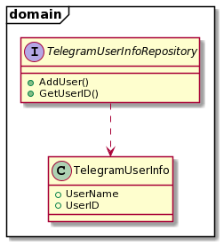
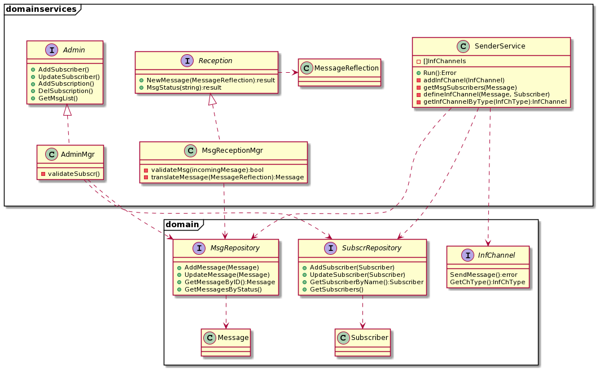
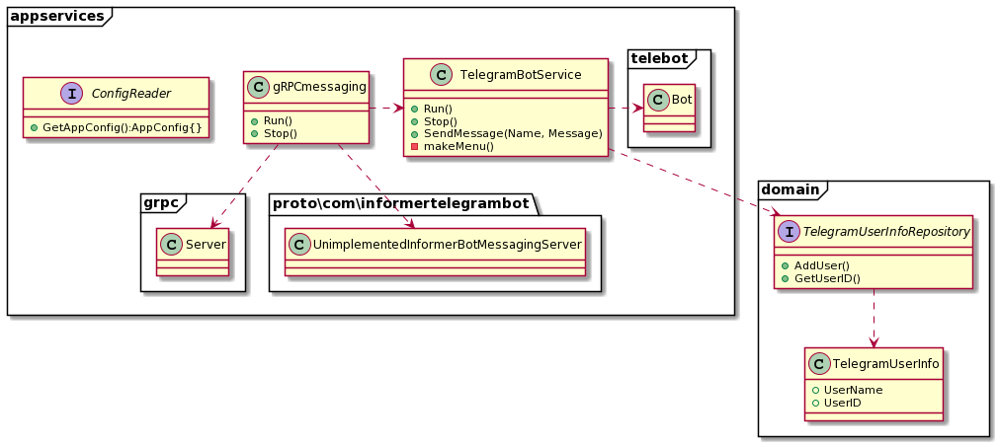
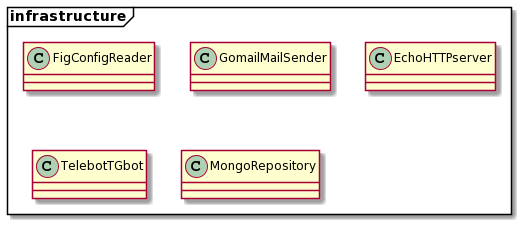
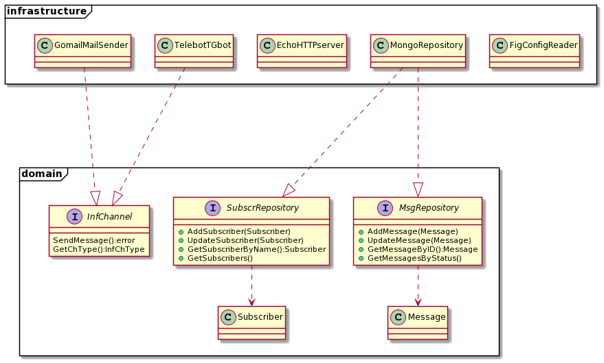
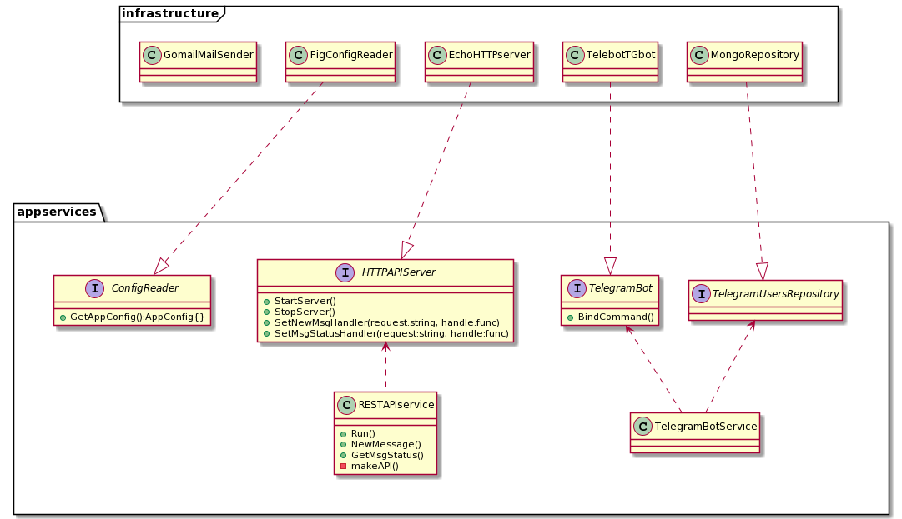

# Application model

The application is developed based on the Onion architecture and dependency injection technique.

According to Onion architecture pattern it's divided to application core, which includes domain, domain services and app services levels, and infrastructure level which contains services implementations.

This is described with UML class diagrams.

## Domain

## Domain and domain services level

## App services level

## Infrastructure level

### Domain implementation

### App services implementation

